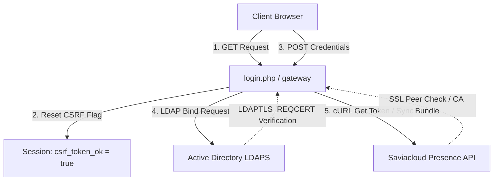

# Design: Security and Usability Fixes

## 1. Technical Approach

We are implementing targeted security and stability fixes across session security, CSRF lifecycle, and secure external connections:

*   **Secure Session Cookies**: Re-order the initialization logic to apply cookie configuration parameters *before* calling `session_start()`. Ensure it runs globally via inclusion in `private/config.php`.
*   **CSRF Usability**: Reset `$_SESSION['csrf_token_ok'] = true` whenever a critical gateway (`login.php`, `change_pwd.php`, `rescue.php`, `totp.php`) is requested via `GET`, clearing residual failure flags from invalid POST redirects.
*   **Production LDAP TLS Verification**: Transition `LDAPTLS_REQCERT` from a hardcoded `never` to an environment-aware variable. Demands full validation in `production` while permitting `never` in development environments.
*   **Production cURL SSL/TLS Peer Verification**: Re-enable strict host and peer validations (`CURLOPT_SSL_VERIFYPEER => true`, `CURLOPT_SSL_VERIFYHOST => 2`) for API calls. Support an optional, configurable `curl_ca_bundle` path in `config.ini` for deployment environments needing specialized trust stores.
*   **Duplicate Cleanups**: Remove redundant `checkip.php` imports in `index.php`.

---

## 2. Architecture Decisions

### Session Cookie Security Order
*   **Context**: Calling `session_set_cookie_params()` or `ini_set('session.use_strict_mode')` after `session_start()` does not affect the headers generated for the current session.
*   **Decision**: We restructure `lib/session_security.php` to set strict mode and cookie configurations before starting the session. `private/config.php` will include `lib/session_security.php` at its entry point, guaranteeing all session-based entry points adopt secure attributes (HttpOnly, Secure on HTTPS, SameSite=Lax) from the start.

### Environment-Aware LDAPTLS_REQCERT
*   **Context**: Setting `LDAPTLS_REQCERT` to `never` allows man-in-the-middle (MITM) attacks.
*   **Decision**: Define `$ldap_reqcert` in `private/config.php`. It defaults to `demand` if `$app_env === 'production'` and `never` in other environments. We also allow overriding this globally in `private/config.ini` via `ldap_reqcert`.

```php
$ldap_reqcert = $config['ldap']['ldap_reqcert'] ?? ($app_env === 'production' ? 'demand' : 'never');
putenv("LDAPTLS_REQCERT=$ldap_reqcert");
```

### Configurable CA Bundle for Secure APIs
*   **Context**: Validating certificates requires access to a valid local trust store (CA bundle), which may be missing or outdated on Windows/XAMPP servers.
*   **Decision**: Enable `CURLOPT_SSL_VERIFYPEER` and `CURLOPT_SSL_VERIFYHOST` in production. We expose a `curl_ca_bundle` configuration option in `config.ini`. If populated, cURL uses it (`CURLOPT_CAINFO`), and PHP streams verify using it (`cafile`).

---

## 3. Data Flow



---

## 4. File Changes

| File | Target Changes |
| :--- | :--- |
| **`lib/session_security.php`** | Re-order file contents: set `session.use_strict_mode = 1` and `session_set_cookie_params` first, then run `session_start()`. |
| **`private/config.php`** | Include `lib/session_security.php` as `require_once` at top. Detect `$ldap_reqcert` and `$curl_ca_bundle` from config and environment; set environment variables accordingly. |
| **`private/config.ini`** | Add configuration comments/template lines for `ldap_reqcert` and `curl_ca_bundle` under `[ldap]` and `[medley]`. |
| **`login.php`**<br>**`change_pwd.php`**<br>**`rescue.php`**<br>**`totp.php`** | Add check: `if ($_SERVER['REQUEST_METHOD'] === 'GET') { $_SESSION['csrf_token_ok'] = true; }` at entry to ensure cookie/validation state reset. |
| **`lib/get_token.php`**<br>**`lib/sync_presence.php`**<br>**`lib/test_native.php`** | Set `CURLOPT_SSL_VERIFYPEER => true` and `CURLOPT_SSL_VERIFYHOST => 2`. Inject `CURLOPT_CAINFO` if `$curl_ca_bundle` is defined. Update stream context settings in `lib/test_native.php`. |
| **`index.php`** | Remove duplicate `require_once('./lib/checkip.php');` import on lines 16-17. |

---

## 5. Testing Strategy

### 1. Session Cookie Integrity
*   Request any page over HTTPS.
*   Verify in browser developer tools (Application -> Cookies) that the active session cookie contains `HttpOnly`, `Secure` (when HTTPS), and `SameSite=Lax` parameters.

### 2. CSRF Usability Check
*   Intentionally submit an invalid or empty `csrf_token` POST request.
*   Confirm redirection and that subsequent normal `GET` loads re-enable the CSRF validation pipeline successfully without locking out users.

### 3. Secure Production LDAP/cURL TLS Check
*   Toggle `APP_ENV=production` and trigger the synchronization scripts.
*   Assert validation fails if certificates are invalid (e.g. self-signed without proper trust).
*   Assert validation succeeds once a valid `$curl_ca_bundle` containing the server's root CA is referenced in `config.ini`.
